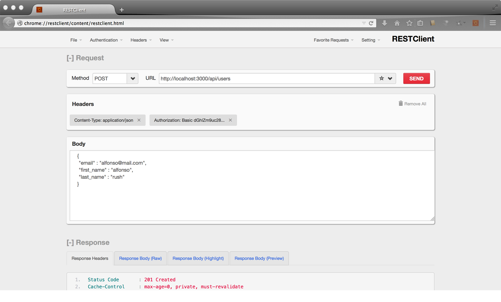

# API tutorial - using the REST client Firefox plugin

To access any API service, You need to write REST client code in your application. But you can try out any API services in your browser itself. Good REST client tools are available for both Firefox and Chrome. I will explain, installing a tool in Firefox and how to use it.

**STEP 1 : Installing the REST client tool**

=> open your Firefox browser

=>You can find the REST client tool, through the below steps

click tool tab at top of browser  -> click **web developer**  from the list -> click **get more tools** ->click **Extensions** down the adds on tab -> search **rest client** -> install the one with the title: **RESTClient, a debugger for RESTful web services** by click the button **add to Firefox**

=> Once installed, you can see a brown square icon with a circle in it at the top right hand side of the browser. click it to start the tool

**STEP 2: Understanding the tool**

The REST client UI in the browser looks like so...

You can test any REST API with the above tool. To use any API, you need to have information about its various services, see the sample API created in [this post](readme.md) and read its documentation. These are the things, you need to fill in the above UI, before making a call.

Authorization :

It list various types of authorization you need to setup before accessing any API. In the sample API I have provided basic authorization with username and password. Thus, click on **basic authorization**, fill the username and password and click O.K. It is one time process and will set your authorization for the current session.

Content Type :

You need to setup, the content type of your request body. In the API documentation you can find various types of content type supported by it. You can set content type by: **click on header -> click on custom header -> In the popup, fill up Content-Type in name field and application/xml or application/json or application/x-www-form-urlencoded or anyother as per your need  in the value field-> click O.K**

This can be also a one time process and you do not need to change it untill you want to try it out with any other content type.

API Requests :

Set, proper **method, url and body** in the above Rest Client UI as specified by the API documentation and then click the **send** button

API Response :

Once, the request is completed, you can see **Response tab** appearing at the bottom with **Header, Response Body(raw), Response Body(highlight),  Response Body(Preview)**. The Header will contain the status of the response i.e. success or failed, and the response body will contain the data returned by the API to you

View tutorial readme pages / code:

part 1 - [Build an API provider](https://github.com/thefonso/api_provider/)

part 2 - [a REST client for Firefox here](https://github.com/thefonso/api_provider/blob/master/rest_firefox_client.md)

part 3 - [How to build a REST client](https://github.com/thefonso/api_consumer/)